dev na new byte e estudante de sistemas de informação.

mexo profissionalmente com backend e integrações. aqui embaixo mora o resto: microcontrolador, um pouco de ml e coisas que fiz pra entender como funcionam.

sinta-se livre pra fazer perguntas. mensagem, email, sinal de fumaça.

---

---

<picture>
  <source media="(prefers-color-scheme: dark)" srcset="https://raw.githubusercontent.com/arturritzel/arturritzel/output/github-contribution-grid-snake-dark.svg" />
  
</picture>
